# topic 通信 publisher


## C++实现

1. 头文件

   ```c++
   #include <ros/ros.h>
   #include<std_msgs/String.h>
   ```

   

2. 初始化

   ```c++
   ros::init(argc, argv, "chao_node");
   ```

   

3. 实例化NodeHandle对象

   ```c++
   ros::NodeHandle nh;
   ```

4. timesleep

   ```c++
    std_msgs::String msg;
           msg.data = "msg_of_chao";
   ```

完整demo

```c++
#include <ros/ros.h>
#include<std_msgs/String.h>

int main(int argc, char  *argv[])
{
    ros::init(argc, argv, "chao_node");
    ros::NodeHandle nh;
    ros::Publisher  pub =  nh.advertise<std_msgs::String>("my_chao_topic", 10);
    ros::Rate loop_rate(10);

    while (ros::ok())
    {
        printf("chao!\n");		
        std_msgs::String msg;
        msg.data = "msg_of_chao";
        pub.publish(msg);
        loop_rate.sleep();
    }

    return 0;
} 
```

## python实现

1. 头文件

   ```python
   #!/user/bin/env python
   # encoding:utf8
   
   import rospy
   from std_msgs.msg import String
   ```

2. 初始化

   ```python
   rospy.init_node("chao_node")
   ```

3. 用rospy编辑话题名称等参数

   ```python
   pub = rospy.Publisher("my_chao_topic", String, queue_size=10)
   ```


demo

```python
#!/usr/bin/env python
# encoding:utf8

import rospy
from std_msgs.msg import String

if __name__ == "__main__":
    rospy.init_node("chao_node")
    rospy.logwarn("chao!py!")

    pub = rospy.Publisher("my_chao_topic", String, queue_size=10)
    rate = rospy.Rate(10)

    while not rospy.is_shutdown():
        rospy.loginfo("chao!!!py")
        msg = String()
        msg.data = "msg_of_chao_py"
        pub.publish(msg)
        rate.sleep()
```


# topic 通信 subscriber

## C++实现


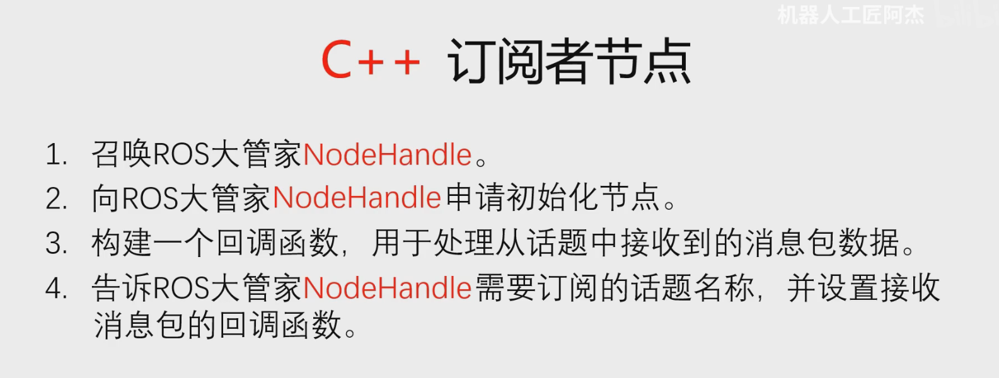

demo

```c++
#include <ros/ros.h>
#include <std_msgs/String.h>
void lidar_callback(std_msgs::String msg)
{
    ROS_INFO(msg.data.c_str());
}

void chao_callback(std_msgs::String msg)
{
    ROS_WARN(msg.data.c_str());
}

int main(int argc, char *argv[])
{

    ros::init(argc, argv, "speed_node");
    setlocale(LC_CTYPE, ""); // 自动继承系统Locale
    
    ros::NodeHandle nh;
    ros::Subscriber sub = nh.subscribe<std_msgs::String>("my_lidar_topic", 10, lidar_callback);
    ros::Subscriber sub_2 = nh.subscribe<std_msgs::String>("my_chao_topic", 10, chao_callback);
    while (ros::ok())
    {
        ros::spinOnce();
    }

    return 0;
}
```


**需要注意**这里的`  ros::spinOnce();`相当于终端函数的使能，没有这句中断函数就不会执行

## python实现

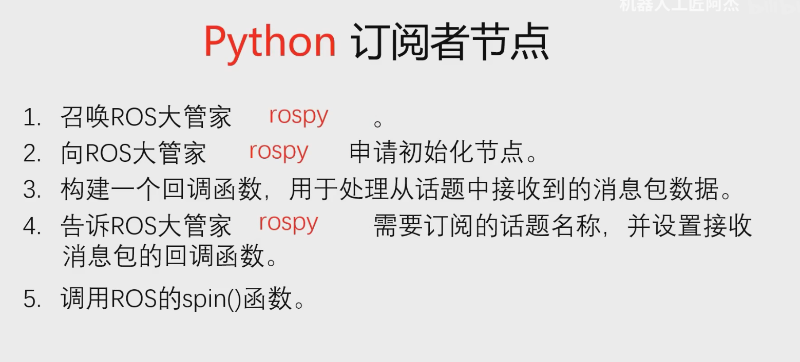

### 标准起手式：

```python
#!/usr/bin/env python
# encoding:utf8

import rospy
from std_msgs.msg import String

if __name__ == "__main__":
```

### 主要函数

```python
#!/usr/bin/env python
# encoding:utf8

import rospy
from std_msgs.msg import String

def lidar_callback(msg):{
    rospy.logwarn(msg.data)
}
    
def chao_callback(msg):{
    rospy.loginfo(msg.data)
}

if __name__ == "__main__":
    rospy.init_node("speed_node")
    sub = rospy.Subscriber("my_chao_topic", String,  lidar_callback, queue_size= 10 )
    sub2 = rospy.Subscriber("my_lidar_topic", String,  chao_callback, queue_size= 10 )
    while not rospy.is_shutdown():{
        rospy.spin()
    }
```


# launch文件启动多个节点

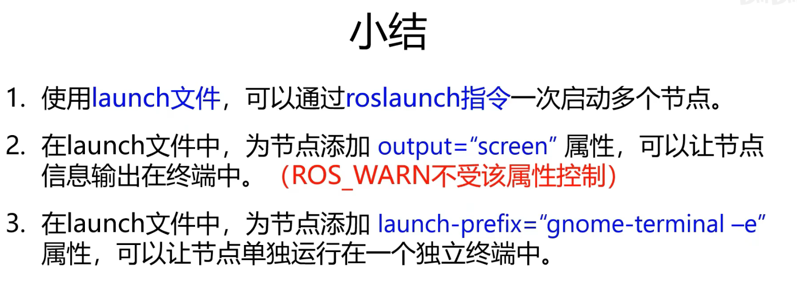

demo

```xml
<launch>

    <node pkg="ssr_pkg" type="chao_node" name="chao_node" />
    <node pkg="ssr_pkg" type="lidar_node" name="lidar_node" launch-prefix="gnome-terminal -e"  />
    <node pkg="atr_pkg" type="speed_node" name="speed_node"  output = "screen"/>
    
</launch>

```

* 为什么type和name一样？

  ```xml
  <launch>
  
      <node pkg="ssr_pkg" type="chao_node.py" name="chao_node"  />
      <node pkg="ssr_pkg" type="lidar_node.py" name="lidar_node"   />
      <node pkg="atr_pkg" type="speed_node.py" name="speed_node"  launch-prefix="gnome-terminal -e"/>
      
  </launch>
  ```

  由这里就能看出，也许存在同名不同包，同名不同语言的情况

* ### **小技巧**

`rqt_grath`可以看到当前节点和话题通讯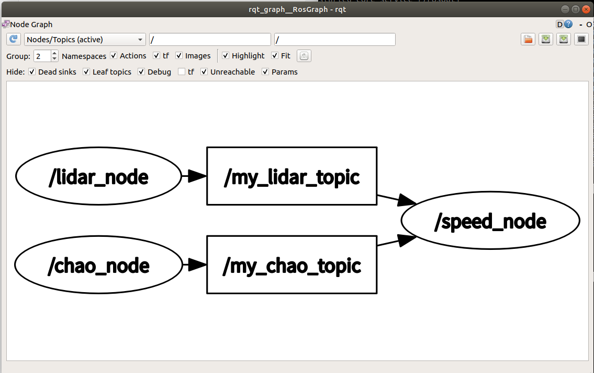

# 机器人运动控制

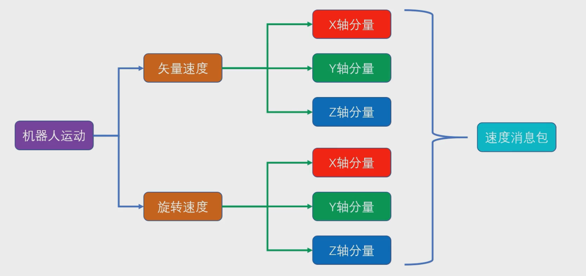


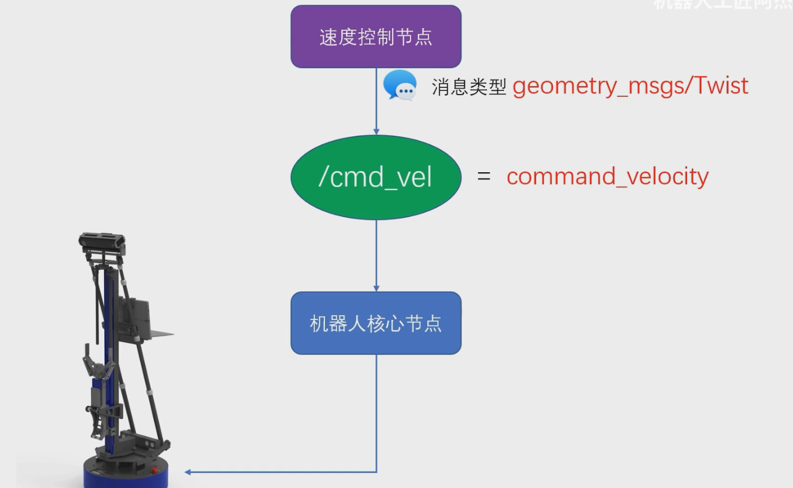


## geometry_msgs/Twist

* [ros.index的网站在这](https://docs.ros.org/en/noetic/api/geometry_msgs/html/index-msg.html)

* [twist在这](https://docs.ros.org/en/noetic/api/geometry_msgs/html/msg/Twist.html)
* 结构就类似这样

## python实现:smile:

### ==思路== :cry:

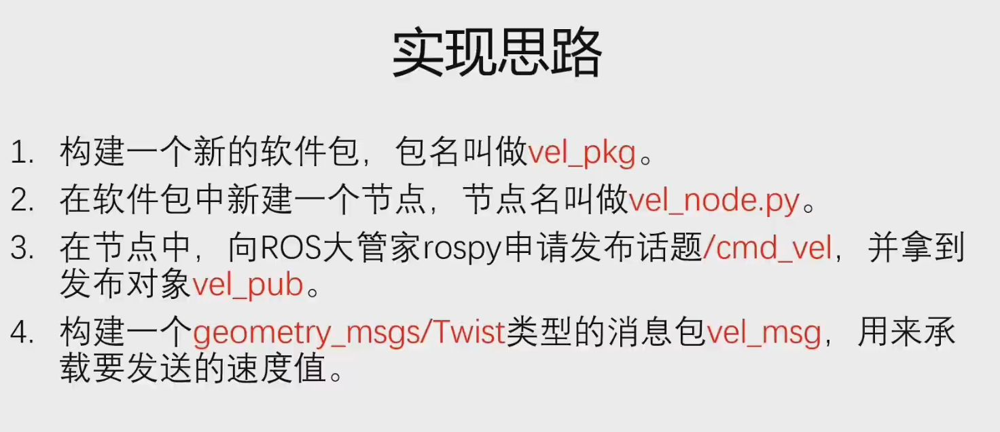

### demo

# git 工具

 配置默认分支（避免 `master` 问题）

```bash
git config --global init.defaultBranch main  # 设置默认分支为 main
```

---

## 基础配置

### 1. 用户身份
```bash
git config --global user.name "Your Name"
git config --global user.email "your@email.com"
```

### 2. SSH 密钥配置（避免 HTTPS 重复验证）
```bash
ssh-keygen -t ed25519 -C "your@email.com"  # 生成密钥
cat ~/.ssh/id_ed25519.pub                 # 复制公钥
```
- 将公钥添加到 GitHub: **Settings → SSH and GPG keys**

### 3. 测试 SSH 连接
```bash
ssh -T git@github.com  # 应返回成功消息
```

---

## 项目初始化

### 1. 本地仓库
```bash
mkdir project && cd project
git init  # 自动创建 main 分支（因已配置默认分支）
```

### 2. 关联远程仓库
```bash
git remote add origin git@github.com:yourname/repo.git
```

### 3. 首次提交
```bash
echo "# My Project" > README.md
git add .
git commit -m "Initial commit"
git push -u origin main  # -u 绑定上游分支
```

---

## 基础操作

### 1. 提交工作流
```bash
git add filename      # 添加单个文件
git add .             # 添加所有修改
git commit -m "msg"   # 提交到本地仓库
git push              # 推送到远程
```

### 2. 撤销操作
```bash
git restore --staged filename  # 取消暂存
git restore filename           # 撤销文件修改
git reset --soft HEAD~1        # 撤销最后一次提交
```

---

## 分支管理

### 1. 创建/切换分支
```bash
git branch dev         # 创建分支
git checkout dev       # 切换分支
git checkout -b hotfix # 创建并切换
```

### 2. 合并分支（解决冲突）
```bash
git checkout main
git merge dev          # 将 dev 合并到 main
```
- **冲突解决**：手动编辑文件后 `git add` 标记解决

### 3. 删除分支
```bash
git branch -d dev      # 删除本地分支
git push origin --delete dev  # 删除远程分支
```

---

## 远程仓库

### 1. 强制推送（谨慎使用）
```bash
git push -f origin main  # 覆盖远程历史（仅限个人分支）
```

### 2. 拉取冲突解决
```bash
git pull origin main     # 相当于 git fetch + git merge
git pull --rebase       # 更干净的提交历史
```

### 3. 仓库迁移
```bash
git remote set-url origin git@github.com:new/repo.git
```

---

## 高级问题

### 1. SSH 连接失败处理
```log
ssh_exchange_identification: Connection closed by remote host
```
**解决方案**：
- 修改 SSH 端口为 443：
  ```bash
  # ~/.ssh/config
  Host github.com
    Hostname ssh.github.com
    Port 443
  ```
- 检查防火墙/代理设置

### 2. `master` 迁移到 `main`
```bash
git branch -m master main          # 重命名本地分支
git push -u origin main            # 推送新分支
git push origin --delete master    # 删除旧分支
```

### 3. 提交被拒绝

```log
! [rejected] main -> main (non-fast-forward)
```
**解决方案**：
```bash
git pull origin main        # 先合并远程变更
git push origin main        # 重新推送
```

### 4.使用 Git 子模块

**适用场景**：保持他人项目独立，方便同步更新
​**​操作步骤​**​：

1. **删除当前空文==件夹==**（假设路径为 `external_project`）：

   bash

   复制

   ```bash
   rm -rf external_project  # 删除空文件夹
   ```

2. **添加子模块**（将别人的仓库挂载到你的项目中）：

   bash

   复制

   ```bash
   git submodule add https://github.com/other_user/external_project.git external_project
   ```

3. **提交变更**：

   bash

   复制

   ```bash
   git add .gitmodules external_project
   git commit -m "添加外部项目作为子模块"
   git push
   ```

4. **在其他设备克隆时初始化子模块**：

   bash

   复制

   ```bash
   git clone --recursive https://github.com/your_username/your_project.git
   # 如果已克隆但未初始化：
   git submodule update --init --recursive
   ```

**优点**：

- 保留原项目独立提交历史
- 可随时通过 `git submodule update` 同步更新
- 明确区分代码归属

---

## 附录：常用命令速查

| 操作     | 命令                        |
| -------- | --------------------------- |
| 查看状态 | `git status`                |
| 查看历史 | `git log --oneline --graph` |
| 暂存修改 | `git stash`                 |
| 比较差异 | `git diff`                  |
| 标签管理 | `git tag v1.0`              |

---

> **文档更新日志**  
> - 2023-10-05 新增 SSH 端口443解决方案  
> - 2023-09-20 补充分支重命名操作

[Git 官方文档](https://git-scm.com/doc) | [GitHub 官方教程](https://docs.github.com/zh/get-started)

# 激光雷达

## 激光雷达消息包格式

[网站在这](https://docs.ros.org/en/noetic/api/sensor_msgs/html/index-msg.html)


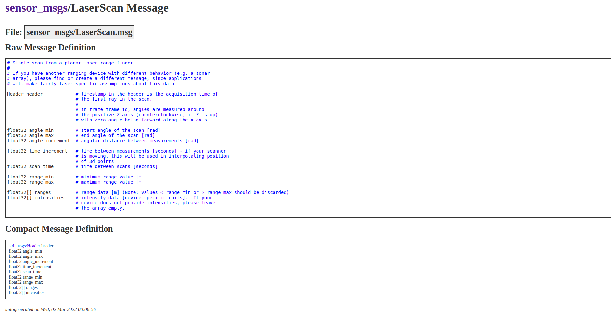

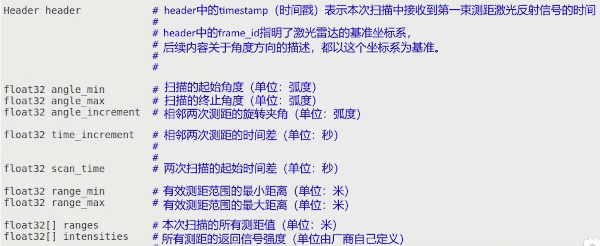

用` rostopic echo /scan --noarr`把数组折叠起来

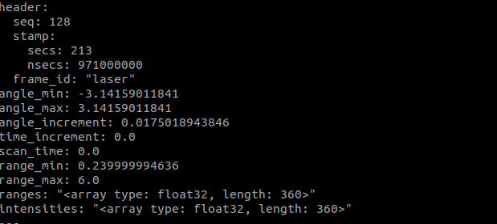

## 获取激光雷达数据python实现

### 思路

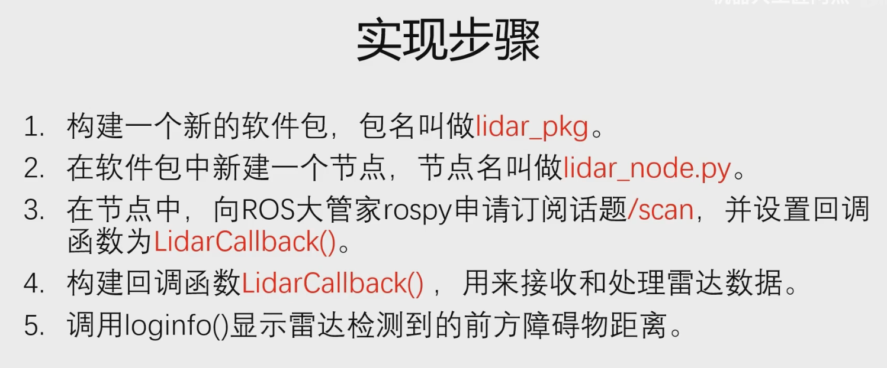

### demo

```python
import rospy
from sensor_msgs.msg import LaserScan

def lidar_callback(msg):
    dist = msg.ranges[180]
    rospy.loginfo("front dist ranges[180] = %f ", dist)
    
if __name__ == "__main__":
    rospy.init_node("lidar_node")
    sub = rospy.Subscriber("/scan", LaserScan,  lidar_callback, queue_size= 10 )
    rospy.spin()
```

## 激光雷达避障

### python实现

#### 思路

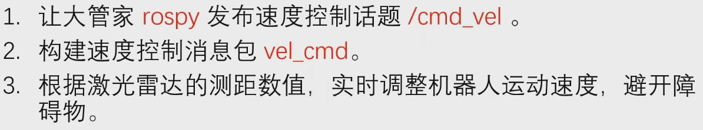


